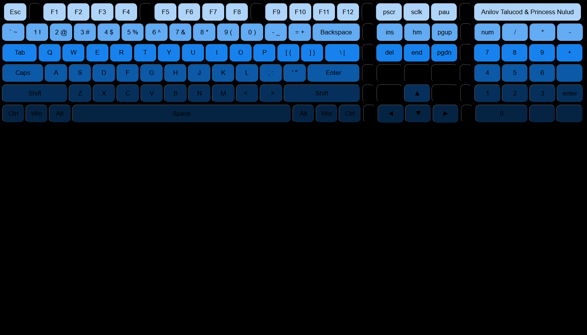
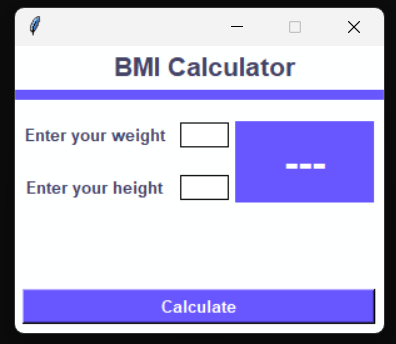

#Anilov G. Talucod Portfolio

This repository contains the source code for Anilov G. Talucod's personal portfolio website. The website showcases Anilov's experience, skills, projects, and contact information.

## Table of Contents
- [Demo](#Demo)
- [Technologies Used](#technologies-used)
- [Project Structure](#project-structure)
- [Features](#features)
- [Getting Started](#getting-started)

## Demo

You can view the live demo of the portfolio here.


## Technologies Used

- HTML
- CSS
- Boxicons

## Project Structure

The project consists of the following main files and directories:
- `index.html`: The main HTML file containing the structure of the portfolio website.
- `CSS/style.css`: The CSS file for styling the portfolio website.
- `img/`: Directory containing images and other media files used in the website.
- `project1/`: Directory containing the first project.
- `project2/`: Directory containing the second project.
- `project3/`: Directory containing the third project.

## Features

- **Home Section**: A welcome message with my name and a link to download my CV.
- **About Section**: Information about me, my education, interests, and skills.
- **Projects Section**: A gallery of my projects and links to view some details.
- **Contact Section**: A form to get in touch with me via email.

## Getting Started

To view the website, simply open the `index.html` file in your web browser.

### Prerequisites

Make sure you have a web browser installed (e.g., Chrome, Firefox).

### Installation

```bash
# Clone this repository
$  git clone https://github.com/AnilovTalucod/Portfolio.git


# Navigate to the project directory:
    ```bash
    cd your-repo-name
    ```

# Open index.html in your web browser to view the portfolio.
```

<br/>
<br>

## Template Instructions:

## Step 1 - STYLES

Make sure you have started the CSS compilation by running

make sure the css is connected in html

<br/>

<br/>

## Step 2 - Homepage

Go to `index.html` and fill your information, there are 6 sections:

### Navigation Bar Code

- This section of the code represents the navigation bar for Anilov Talucod's portfolio website. The navigation bar allows users to quickly        navigate to different sections of the website such as About, Experience, Projects, and Contact.

```HTML Structure
 <!--Start Nav-->
    <nav>
       <div class="container nav-container">
        <a href="" class="logo">Anilov Talucod</a>
        <ul class="nav-links">
            <li><a href="#About">About</a></li>
            <li><a href="#Experiences">Experience</a></li>
            <li><a href="#Projects">Projects</a></li>
            <li><a href="#Contact">Contact</a></li>
        </ul>
       </div> 
    </nav>
    <!--End Nav-->
    ```
  ```
### Header Code

- This section of the code represents the header for Anilov Talucod's portfolio website. The header includes a profile picture, a brief introduction, professional title, call-to-action buttons, and social media links.

```HTML Structure
<!--Start Header-->
    <header>
      <div class="container header-container">
        <div class="header-left">
            
        </div>
        <div class="header-right">
          <p><b>Hello I'm</b></p>
          <h1>Anilov Talucod</h1>
          <h2>Frontend Developer</h2>
          <div class="header-action-aria">
            <a href="https://6658a9290f97523be5a76676--merry-gelato-5bf849.netlify.app/" class="btn" download="./img/CV.pdf">Download CV</a>
            <a href="#Contact" class="btn btn-dark">Contact info</a>
          </div>
          <marquee behavior="" direction=""><div class="header-social">
            <a href="https://www.linkedin.com/in/talucod-anilov-g-8b0b5430a/"></a>
            <a href="https://github.com/AnilovTalucod"></a>
            <a href="https://www.facebook.com/lovAni.Talucod"></a>
            <a href="https://discord.com/channels/@me"></a>
          </div></marquee>
        </div>
      </div>
    </header>
<!-- End Header -->
```
``
### About Section Code
 
 - This section of the code represents the "About" section for Anilov Talucod's portfolio website. It provides a brief introduction about Anilov, including a profile picture, educational background, and personal interests.

 ```HTML Structure
 <!--Start About Section -->
   <section id="About">
    <p class="heading-p">Get To Know More</p>
    <h1 class="heading">About Me</h1>
    <div class="container about-container">
        <div class="about-left">
            
        </div>
        <div class="about-right">
            <div class="basic-edu">
                <div class="edu-box">
                    
                    <h4>Experience</h4>
                    <p>
                         <br>
                        
                    </p>
                </div>
                <div class="edu-box">
                    
                    <h4>Education</h4>
                    <p>
                        Second Year <br>
                        BSIS 2 PROVA
                    </p>
                </div>
            </div>
            <P>
                Hi! I'm Anilov Talucod, and I have a passion for motorcycles and the art of fixing them. Ever since I was young, I've been fascinated by the mechanics and engineering that make motorcycles roar to life.
                My hobby involves diving into the intricacies of motorcycle repair and maintenance.
            </P>
        </div>
    </div>
   </section>
<!--End About Section -->
 ```
  ``
  ### Experience Section Code

  - This section of the code represents the "Experience" section for Anilov Talucod's portfolio website. It highlights his skills and experience as a frontend and backend developer.

```HTML Structure
  <!--Start Experience Section -->
   <section id="Experiences">
    <a href="#Experiences" class="arrow"></a>
    <p class="heading-p">Explore My</p>
    <h1 class="heading">Experience</h1>
    <div class="container experience-container">
        <div class="experience-box">
            <h2>Frontend Developer</h2>
            <div class="experience">
                <div class="ex-div">
                    
                    <div>
                        <h4>HTML</h4>
                        <p>Basic</p>
                    </div>
                </div>
                <div class="ex-div">
                    
                    <div>
                        <h4>CSS</h4>
                        <p>Basic</p>
                    </div>
                </div>
                <div class="ex-div">
                    
                    <div>
                        <h4>Python</h4>
                        <p>Basic</p>
                    </div>
                </div>
                <div class="ex-div">
                    
                    <div>
                        <h4>JavaScript</h4>
                        <p>Basic</p>
                    </div>
                </div>
            </div>
        </div>
        <div class="experience-box">
            <h2>Backend Developer</h2>
            <div class="experience">
                <div class="ex-div">
                    
                    <div>
                        <h4>Python</h4>
                        <p>Basic</p>
                    </div>
                </div>
                <div class="ex-div">
                    
                    <div>
                        <h4>MySQL</h4>
                        <p>Basic</p>
                    </div>
                </div>
            </div>
        </div>
    </div>
   </section>
<!--End Experience Section -->
```
## Project Section Code

- This section of the code represents the "Projects" section for Anilov Talucod's portfolio website. It showcases his recent projects with links to live demos.

```HTML Structure
<!--Start Projects Section -->
   <section id="Projects">
    <a href="#Projects" class="arrow"></a>
    <p class="heading-p">Browse My Recent</p>
    <h1 class="heading">Projects</h1>
    <div class="container project-container">
        <div class="project">
            
            <h3>Project 1</h3>
            <div class="header-action-aria">
                <a href="https://6658a65d7ea6b0323f61456e--spontaneous-sawine-b8a415.netlify.app/" class="btn">KEYBOARD</a>
                <a href="https://6658a65d7ea6b0323f61456e--spontaneous-sawine-b8a415.netlify.app/" class="btn">LIVE DEMO</a>
            </div>
        </div>
        <div class="project">
            
            <h3>Project 2</h3>
            <div class="header-action-aria">
                <a href="https://6658abb56690d53e7bcfb888--vermillion-sorbet-df01e1.netlify.app/" class="btn">BMI</a>
                <a href="https://6658abb56690d53e7bcfb888--vermillion-sorbet-df01e1.netlify.app/" class="btn">LIVE DEMO</a>
            </div>
        </div>
        <div class="project">
            
            <h3>Project 3</h3>
            <div class="header-action-aria">
                <a href="https://6658a9290f97523be5a76676--merry-gelato-5bf849.netlify.app/" class="btn">RESUME</a>
                <a href="https://6658a9290f97523be5a76676--merry-gelato-5bf849.netlify.app/" class="btn">LIVE DEMO</a>
            </div>
        </div>
    </div>
   </section>
<!--End Projects Section -->
```
## Contact Section Code

- This section of the code represents the "Contact" section for Anilov Talucod's portfolio website. It provides ways to get in touch with Anilov through email and LinkedIn, as well as links to his social media profiles.

```HTML Structure
<!--Start Contact Section -->
   <section id="Contact">
    <a href="#Contact" class="arrow"></a>
    <p class="heading-p">Get In Touch </p>
    <h1 class="heading">Contact Me</h1>
    <div class="contact-container container">
        <div class="email">
            
            <a href="https://myaccount.google.com/?hl=en&utm_source=OGB&utm_medium=act"><h5>anilovtalucod52@gmail.com</h5></a>
        </div>
        <div class="linkedin">
            
            <a href="https://www.linkedin.com/in/talucod-anilov-g-8b0b5430a/"><h5>Linkedin</h5></a>
        </div>
    </div>
    <div class="header-social">
        <a href="https://github.com/AnilovTalucod"></a>
        <a href="https://www.facebook.com/lovAni.Talucod"></a>
        <a href="https://discord.com/channels/@me"></a>
      </div>
   </section>
<!--End Contact Section -->
```

## Footer Section Code

```HTML Structure
<!--Start Footer Section -->
   <footer>
    <ul class="nav-links">
    <li><a href="#About">About</a></li>
    <li><a href="#Experiences">Experiences</a></li>
    <li><a href="#Projects">Projects</a></li>
    <li><a href="#Contact">Contact</a></li>
    </ul>
    <p>&copy; Copyright Your Anilov Talucod || All rights Reserved.</p>
   </footer>
   <!--End Footer Section -->
   ```

## Step 3 - Project Page

- Each project will have its own Page. The project page will have important details about the project like the Project Title, Description, Technologies, Project Links, etc.

<br>

``

<br>
``

## Deployment 

Once you have done with your setup. You need to put your website online!

I highly recommend to use [Netlify](https://netlify.com) to achieve this on the EASIEST WAY

Whenever you wanna host a new site on Netlify. You will need to press the **Create New Site** button from the Netlify's dashboard once you login into Netlify.

Once you press the **Create Site Button** then you will have to follow the 3 steps:

1. You will have to select your Github account.

2. Then select the Repository which you wanna host, in this case its your Portfolio website ( Clone of Dopefolio )

3. In the 3rd step, you will have to modify the **Site settings and deploy**, keep everything as it is but just make sure to modify the **Build command** and set its value to **npm run build** and then modify the **Publish directory** and set its value to **/** as shown in the  **image** below
